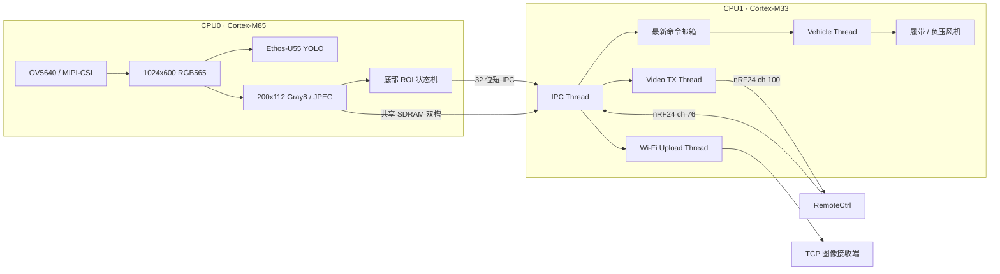

# RA8P1 光伏板智能巡检车

本分支是巡检车现行固件，面向 Renesas RA8P1 双核 MCU：Cortex-M85 负责视觉采集、AI、图像编码和导航判断，Cortex-M33 负责无线通信、共享图像接收、网络上传与底盘执行。

> 当前有效产品代码只有 `Vehicle` 与 `RemoteCtrl` 两个分支。`legacy-single-core` 是早期单核版本，只可作为历史资料或图片来源，不代表当前实现。

## 当前状态

截至 2026-08-16，双核启动、摄像头采集、Gray8/JPEG 图像链路、共享 SDRAM、短 IPC、导航命令、底盘命令邮箱、DA16200 上传以及两条 nRF24 无线链路均已完成软件集成，并有目标板日志验证主要调用链。

| 状态 | 能力 | 说明 |
|---|---|---|
| 已验证 | M85/M33 双核启动与 FreeRTOS 任务 | 两个核心可正常启动并通过 IPC 协作 |
| 已验证 | OV5640 图像采集与本地显示 | MIPI-CSI、VIN、帧缓冲、GLCDC/Dave2D 链路可运行 |
| 已验证 | 200x112 Gray8 JPEG 图传 | M85 编码，经共享 SDRAM 转交 M33，再由 nRF24 发送 |
| 已验证 | 自动导航最小闭环 | 底部中央 ROI 生成 `STOP/FORWARD/TURN_LEFT`，M33 执行 500 ms 失联停车 |
| 已验证 | 手动控制链路 | 遥控器控制包由 M33 的 SPI0 nRF24 接收并送入单槽命令邮箱 |
| 已验证 | DA16200 检测图上传 | 共享 JPEG 经 TCP 上传到 `192.168.137.1:5000` 的接收端 |
| 已集成 | Ethos-U55 YOLO 推理 | 预处理、推理、后处理和结果快照链路完整；模型精度仍需结合赛题数据验收 |
| 待实车验收 | 运动、吸附与 ROI 参数 | 当前前进/转向 90%、风机 80% 均为联调值，需要在真实负载和板面上整定 |
| 暂时隔离 | MPU6050 航向闭环 | 风机动力链会导致 I2C 异常，当前 `VEHICLE_MPU6050_ENABLE=0`，直行为开环 |

## 系统架构



### CPU0：视觉核心

工程目录：`Renesas_Cup_Vehicle_CPU0/`

| 任务 | 优先级 | 栈 | 职责 |
|---|---:|---:|---|
| IPC Thread | 7 | 1 KiB | 处理共享内存通知与跨核消息 |
| Display Thread | 6 | 4 KiB | GLCDC/Dave2D 显示与检测框叠加 |
| Navigation Thread | 6 | 2 KiB | 读取最新 Gray8，执行 ROI 状态机并发送短 IPC |
| AI Thread | 5 | 8 KiB | Helium 预处理、Ethos-U55 推理、YOLO 后处理 |
| Encode Thread | 4 | 8 KiB | RGB565 转 Gray8、JPEG 编码、发布共享帧 |
| Camera Thread | 3 | 6 KiB | OV5640、MIPI-CSI、VIN 采集 |

关键数据路径：

```text
Camera Thread -> 最新 RGB565 帧
    |- AI Thread -> YOLO 结果快照 -> Display / 故障 JPEG
    `- Encode Thread -> 200x112 Gray8
         |- Navigation Thread -> STOP / FORWARD / TURN_LEFT
         `- Gray JPEG -> 共享 SDRAM -> CPU1
```

导航只统计 200x112 图像底部 24 行的三个窗口，中央窗口作为当前主判据。连续帧状态机负责上电预热、危险锁存和恢复，避免单帧噪声直接驱动车轮。

### CPU1：实时控制与通信核心

工程目录：`Renesas_Cup_Vehicle_CPU1/`

| 任务 | 优先级 | 栈 | 职责 |
|---|---:|---:|---|
| Vehicle Thread | 7 | 3 KiB | 唯一拥有 GPT 底盘硬件，执行运动与吸附控制 |
| Command RX Thread | 6 | 2 KiB | SPI0、76 信道，接收遥控器控制包 |
| IPC Thread | 5 | 2 KiB | 解码导航消息、消费共享 JPEG、分发视频与上传作业 |
| Video TX Thread | 4 | 3 KiB | SPI1、100 信道，发送 200x112 JPEG 分片 |
| Wi-Fi Upload Thread | 3 | 6 KiB | 独占 DA16200 UART/TCP 状态机并上传检测图 |

所有底盘命令都先写入单槽“最新值”邮箱，再由 Vehicle Thread 执行。IPC、nRF24 和其他输入源不得直接操作 GPT，这一所有权边界用于避免并发写电机和风机。

## 无线协议

两条链路使用 5 字节地址、2 Mbps、2 字节硬件 CRC 和 Dynamic Payload：

| 功能 | 小车角色 | RF_CH | 地址 | 载荷 | ACK |
|---|---|---:|---|---:|---|
| 控制 | RX / SPI0 | 76 | `CMDRX` | 8 字节 | 开启 |
| 视频 | TX / SPI1 | 100 | `VIDEO` | 32 字节 | 关闭，边界包三发、数据包双发 |

完整字段定义、CRC32 算法和联调判据见 [doc/NRF24_LINK_PROTOCOL.md](doc/NRF24_LINK_PROTOCOL.md)。遥控器端对应文档位于 `RemoteCtrl` 分支的 `doc/NRF24_VEHICLE_PROTOCOL.md`。

## 目录说明

```text
.
|- Renesas_Cup_Vehicle_CPU0/     M85 视觉工程
|  |- src/AI/                    预处理、YOLO 后处理、推理结果快照
|  |- src/Camera/                OV5640 / MIPI-CSI / VIN
|  |- src/Display/               GLCDC 与 Dave2D 叠加
|  |- src/ImageUpload/           JPEG 编码
|  |- src/IPC/                   共享 JPEG 与导航 IPC 协议
|  `- src/*_thread_entry.c       M85 任务入口
|- Renesas_Cup_Vehicle_CPU1/     M33 控制工程
|  |- src/Vehicle/               底盘领域、服务、设备与 FSP 适配层
|  |- src/Radio/                 nRF24 驱动、协议和业务服务
|  |- src/DA16200/               Wi-Fi 模块 AT 驱动
|  |- src/IPC/                   共享 JPEG 接收端
|  `- src/*_thread_entry.c       M33 任务入口
|- doc/                          当前无线协议
|- snapshots/                    调试快照，不是正式源码入口
|- 新对话交接.md                 最新目标板状态与安全交接
`- 自动巡检两天实施计划书.md     导航方案、ROI 数据与实施记录
```

`ra/`、`ra_gen/` 和 `ra_cfg/` 分别包含 FSP/中间件代码、FSP 生成代码和生成配置。业务修改优先放在 `src/`；外设或线程配置应在 FSP Configurator 中修改后重新生成，不要手工长期维护 `ra_gen/`。

## 开发环境与构建

- Renesas e2 studio，支持 RA8P1
- Flexible Software Package 6.5.0
- LLVM for Arm 21.1.1 (`clang_arm`)
- FreeRTOS（FSP AWS FreeRTOS 集成）

建议构建流程：

1. 在 e2 studio 中分别导入 `Renesas_Cup_Vehicle_CPU0` 与 `Renesas_Cup_Vehicle_CPU1`。
2. 确认两个工程均使用同一套 FSP 6.5.0、器件 `R7KA8P1KFLCAC` 和对应核心配置。
3. 如修改 `configuration.xml`，通过 FSP Configurator 重新生成，再检查 `ra_gen/` 差异。
4. 分别构建 CPU0 与 CPU1 的 Debug 配置并烧录两个核心。
5. 通过 SEGGER RTT 核对 `[NAV]`、`[SHM1]`、`[CMD NRF]`、`[VIDEO NRF]`、`[WIFI]` 和 `[VEHICLE]` 日志。

CPU1 最近一次记录的成功构建产物为 `Renesas_Cup_Vehicle_CPU1/Debug/Renesas_Cup_Vehicle_CPU1.srec`；构建产物不作为源码提交依据。

## 当前参数与安全边界

| 参数 | 当前值 | 位置 |
|---|---:|---|
| 导航前进 / 左转 | 90% | `CPU1/src/ipc_thread_entry.c` |
| 上电吸附风机 | 80% | `CPU1/src/vehicle_thread_entry.c` |
| 导航失联停车 | 500 ms | `CPU1/src/vehicle_thread_entry.c` |
| 吸附建立等待 | 2000 ms | `CPU1/src/Vehicle/application/vehicle_service.c` |
| Gray8 尺寸 | 200x112 | `CPU0/src/encode_thread_entry.c` |
| ROI 高度 | 24 行 | `CPU0/src/navigation_thread_entry.c` |
| 中央危险 / 安全阈值 | 65% / 80% | `CPU0/src/navigation_thread_entry.c` |

当前版本不能在无承托的垂直板面运行：MPU6050 已隔离，直行没有航向修正；运动和吸附占空比尚未完成持续电流、温升与机械冲击验收；`vehicle_service_emergency_stop()` 目前会同时停止车轮和吸附风机，后续应拆分“停车并保持吸附”与“全系统关闭”。

## 下一步

1. 在安全承托条件下完成前进、左转、吸附力和 ROI 阈值整定。
2. 用示波器定位风机启动导致 MPU6050 I2C 中止的供电、接地或 EMI 原因，再恢复航向闭环。
3. 为视频链路补充 FPS、连续帧号和长期丢帧率统计。
4. 为手动控制增加明确的周期心跳，并让停车/释放命令抢占普通状态命令。
5. 将运动故障停车与全系统断电语义分离，优先保证负压附着安全。

## 配套分支

- `Vehicle`：本 README 对应的现行双核车端固件。
- `RemoteCtrl`：现行触摸遥控与无线图传终端。
- `gh-pages`：项目展示网页，只描述前两个现行分支。
- `legacy-single-core`：历史单核版本，不用于当前架构、构建或进度判断。
