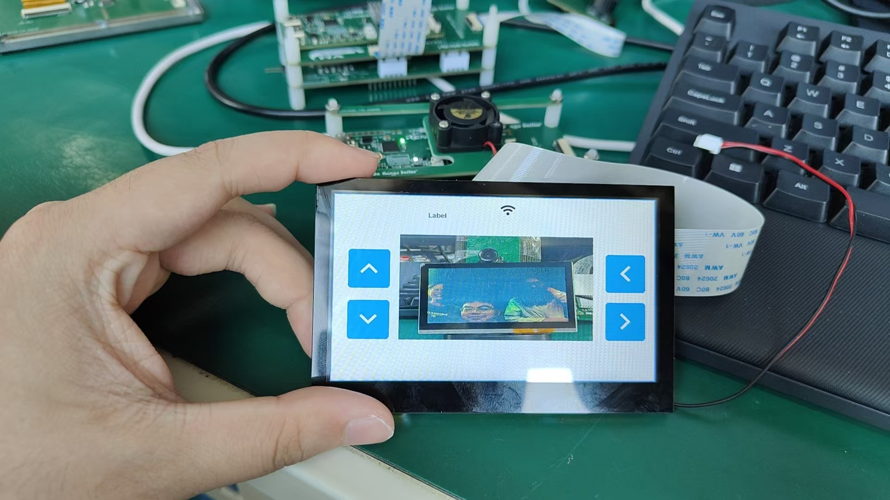
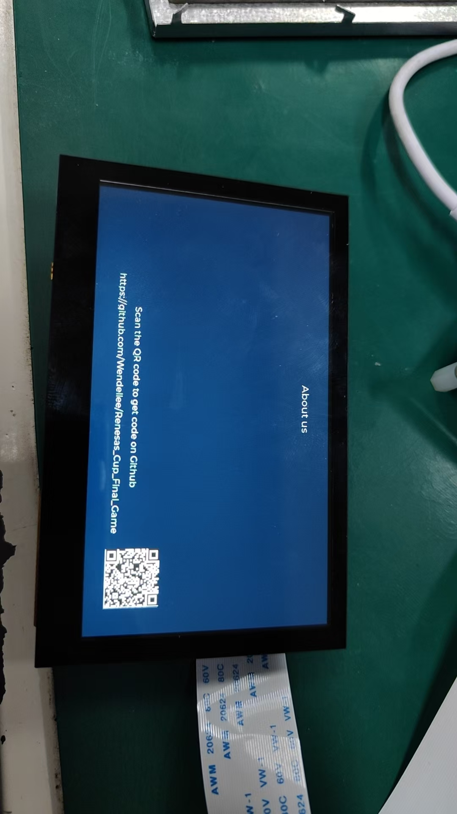
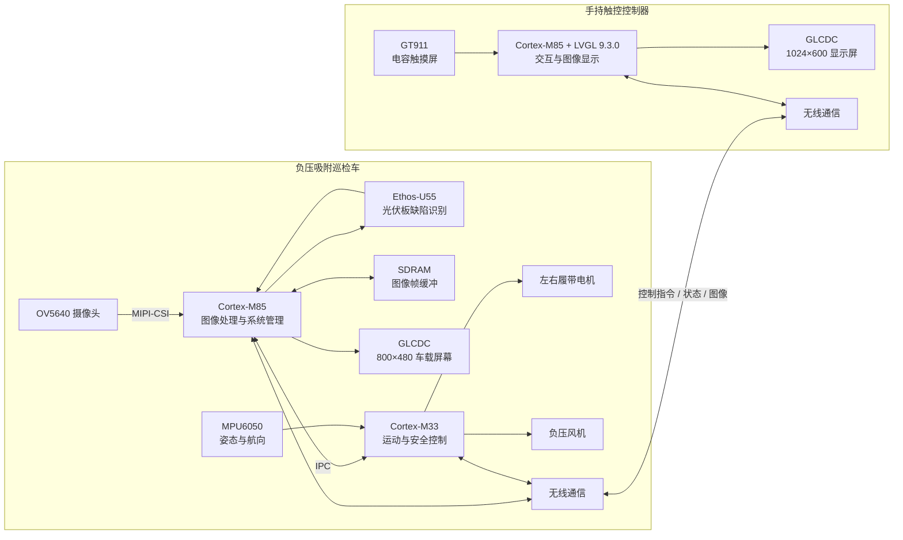
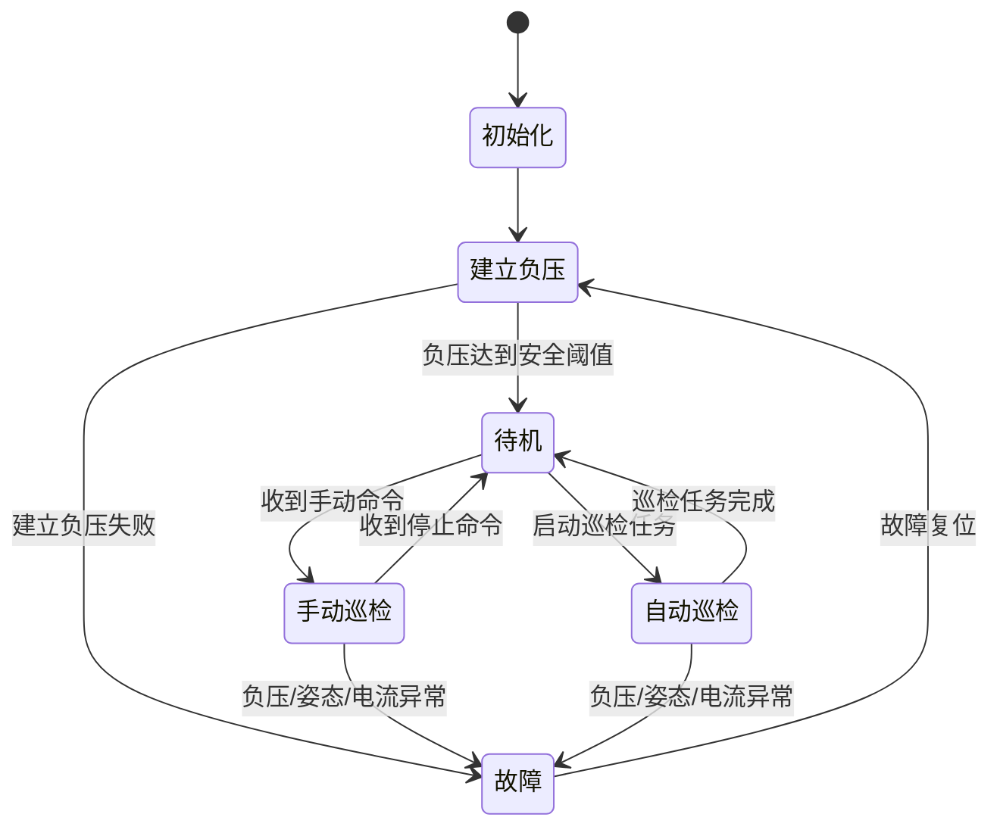

# 基于 RA8P1 的光伏板负压吸附智能巡检系统


本项目是面向光伏板表面缺陷检测场景设计的智能巡检系统，由
**负压吸附履带巡检车**和**手持触控控制器**两部分组成。

巡检车通过负压风机吸附在光伏板表面，使用 OV5640 摄像头采集图像，
并计划利用 Renesas RA8P1 的 Cortex-M85 与 Ethos-U55 NPU 完成缺陷识别；
Cortex-M33 负责履带运动、姿态控制和安全保护。操作员可通过手持控制器
远程控制巡检车，并查看巡检画面、设备状态和 AI 检测结果。

> [!IMPORTANT]
> 项目目前处于功能集成阶段。屏幕、触摸、摄像头和 PWM 等基础外设已完成
> 阶段性测试，FreeRTOS、双核 IPC、AI 推理、无线图传和整机联调仍在完善中。

## 项目展示

当前已完成摄像头画面显示、LVGL 基础界面和部分屏幕适配测试。

| 摄像头画面与 LVGL 界面 | “关于我们”界面 |
| --- | --- |
|  |  |

## 项目目标

本项目希望实现一套能够在光伏板表面稳定运行的嵌入式智能巡检平台：

- 利用负压风机使履带车吸附在倾斜的光伏板表面；
- 控制左右履带完成前进、后退、转向和停止；
- 通过 IMU 航向反馈改善无编码器条件下的直线行驶和定角转向；
- 采集光伏板表面图像，并在边缘端完成缺陷检测；
- 在车载屏幕上叠加缺陷位置、类别和置信度；
- 通过无线链路传输控制指令、设备状态和巡检图像；
- 使用手持触控控制器完成远程操作和结果查看；
- 在吸附异常、姿态异常或通信失联时进入安全状态。

## 系统总体架构

下面是项目的目标架构。高吞吐量的视觉任务与实时运动控制任务相互隔离，
两者通过定义明确的 IPC 消息进行协作。



## 功能组成

### 1. 负压吸附巡检车

巡检车是系统的执行端和主要计算端，包含以下功能：

- **图像采集**：OV5640 通过 MIPI-CSI 接入 RA8P1；
- **图像缓冲**：使用 SDRAM 保存摄像头和显示帧数据；
- **AI 识别**：使用 Ethos-U55 执行光伏板缺陷检测模型；
- **结果显示**：在图像上叠加缺陷框、类别和置信度；
- **履带控制**：GPT 输出 PWM，控制左右履带速度和方向；
- **负压控制**：GPT 输出 PWM，控制吸附风机；
- **航向修正**：利用 MPU6050 和 PID 调整左右履带差速；
- **安全保护**：对负压、姿态、电池、通信和执行器状态进行监测；
- **无线通信**：接收运动命令，返回状态、检测结果和巡检图像。

图像处理链路如下：

```text
OV5640
  → MIPI-CSI
  → SDRAM 帧缓冲
  → 图像预处理
  → Ethos-U55 推理
  → 缺陷结果后处理
  → 本地显示 / 无线发送 / SD 卡保存
```

### 2. 手持触控控制器

控制器是操作员与巡检车之间的人机交互终端，目标功能包括：

- 使用 GT911 电容触摸屏接收操作；
- 使用 LVGL 9.3.0 构建 1024×600 图形界面；
- 控制小车前进、后退、左转、右转和停止；
- 控制负压风机及巡检模式；
- 显示巡检画面、缺陷信息和置信度；
- 显示电池、负压、姿态、通信和故障状态；
- 提供紧急停止和通信失联提示。

## RA8P1 双核职责

项目采用“视觉计算与实时控制分离”的思路：

| 处理单元 | 建议职责 |
| --- | --- |
| Cortex-M85 | MIPI-CSI、图像预处理、NPU 调度、GLCDC、LVGL、图像压缩 |
| Cortex-M33 | 履带和风机 PWM、IMU、PID、运动状态机、无线控制与安全保护 |
| Ethos-U55 | 神经网络模型推理 |
| IPC | 在双核之间传递运动命令、车辆状态、故障和 AI 结果 |

Cortex-M33 上的安全和运动控制不应依赖图像任务是否正常运行。即使视觉处理
或界面暂时阻塞，底层控制仍应能够维持吸附并执行紧急停车。

## 运动控制思路

当前底盘没有编码器，项目计划使用 IMU 航向反馈和标定参数改善运动效果。

直线行驶时，根据航向误差计算左右履带的 PWM 差分量：

```text
左履带 PWM = 基础 PWM - PID 修正量
右履带 PWM = 基础 PWM + PID 修正量
```

定角转向时，左右履带反向转动，并对陀螺仪 Z 轴角速度积分。在接近目标角度
时减速、制动并进行小幅修正。没有编码器时，移动距离只能通过
“标定速度 × 运行时间”近似估算，后续可通过编码器、光流或视觉定位提高精度。

## 安全状态设计

负压吸附属于系统的关键安全功能。目标控制流程为：



建议整机加入负压检测、电池电压检测、电机电流检测、通信心跳和独立急停。
负压不足、姿态异常或通信超时后，应优先停止履带并保持必要的吸附能力。

## 无线通信规划

项目当前计划使用 2.4 GHz 无线链路，并在待办中包含 NRF24L01+ 和
DA16200。考虑到原始图像数据量较大，建议按数据类型划分链路：

- **NRF24L01+**：运动指令、急停、心跳、车辆状态和故障信息；
- **DA16200 / Wi-Fi**：压缩图像、AI 检测结果和巡检文件。

若只使用 NRF24L01+，图像必须先进行缩放、压缩或只传输缺陷区域。无线协议
应包含设备地址、消息类型、序号、长度、CRC、应答、超时和重传机制。

## 主要硬件

| 模块 | 型号或接口 | 用途 |
| --- | --- | --- |
| 主控 | Renesas RA8P1（R7KA8P1KFLCAC） | 双核控制、图形和边缘 AI |
| AI 加速器 | Ethos-U55 | 光伏板缺陷模型推理 |
| 摄像头 | OV5640 / MIPI-CSI | 巡检图像采集 |
| 图像存储 | 外部 SDRAM | 摄像头和显示帧缓冲 |
| 车载显示 | RGB 800×480 | 本地图像及识别结果显示 |
| 控制器显示 | RGB 1024×600 | LVGL 交互界面 |
| 触摸屏 | GT911 | 电容触摸输入 |
| IMU | MPU6050 | 航向角和姿态测量 |
| 无线模块 | NRF24L01+ / DA16200 | 控制、遥测和图像传输 |
| 执行机构 | 履带电机、负压风机 | 车辆移动与吸附 |

仓库的 [`hardware`](hardware) 目录中包含 RA8P1 HMI、LCD 转接板、
OV5640 转接板和扩展板等硬件工程文件。

## 软件与工具

| 项目 | 当前使用或规划 |
| --- | --- |
| IDE | Renesas e² studio |
| 配置框架 | Flexible Software Package（FSP）6.5.0 |
| 目标芯片 | RA8P1 / CPU0（当前工程） |
| 编程语言 | C |
| 图形库 | LVGL 9.3.0 |
| 调试输出 | SEGGER RTT |
| RTOS | FreeRTOS（规划集成，当前工程配置为无 RTOS） |
| AI 运行时 | Ethos-U55 相关推理组件（待集成） |

## 仓库结构

```text
.
├─ src/
│  ├─ CAMERA/          # OV5640、I2C 和 MIPI-CSI 驱动
│  ├─ GLCDC/           # 显示控制器驱动
│  ├─ GPT/             # 履带、风机和 LED 的 PWM 控制
│  ├─ SEGGER_RTT/      # RTT 调试输出
│  └─ hal_entry.c      # 当前 CPU0 程序入口
├─ hardware/           # 自研板卡和转接板工程
├─ doc/                # 设计文档、器件资料和开发记录
├─ ra/                 # FSP 驱动代码
├─ ra_cfg/             # FSP 配置头文件
├─ ra_gen/             # FSP 自动生成代码
├─ configuration.xml   # FSP 图形化配置
└─ LICENSE             # MIT License
```

随着双端和双核软件完善，计划进一步拆分为：

```text
firmware/
├─ vehicle/
│  ├─ cpu0_vision/     # M85：摄像头、AI、显示和图像传输
│  └─ cpu1_control/    # M33：运动、IMU、风机和安全
├─ controller/
│  ├─ cpu0_ui/         # M85：LVGL、显示和图像解码
│  └─ cpu1_radio/      # M33：触摸、无线和状态管理
└─ shared/
   ├─ protocol/        # 无线通信协议
   ├─ ipc/             # 双核通信协议
   └─ common/          # CRC、日志和公共数据结构
```

## 当前进度

图例：✅ 已完成阶段性验证　🚧 开发中　⬜ 待开发/待集成

| 功能 | 状态 | 说明 |
| --- | :---: | --- |
| RA8P1 自定义板基础工程 | ✅ | CPU0 工程已建立，FSP 外设配置可用 |
| GPT PWM | ✅ | 已接入左右履带、风机和 LED 实例 |
| OV5640 与 MIPI-CSI | ✅ | 已有驱动代码并完成阶段性摄像头测试 |
| GLCDC 显示 | ✅ | 已有驱动，800×480/1024×600 屏幕完成阶段性测试 |
| GT911 与 LVGL 交互 | ✅ | 开发记录显示触摸交互测试成功 |
| 底盘运动控制 | 🚧 | PWM 基础已具备，IMU 闭环与运动状态机待整合 |
| AI 缺陷识别 | 🚧 | 模型、预处理、U55 推理及结果绘制待集成 |
| NRF24L01+ 无线通信 | 🚧 | 控制协议与图像传输仍在完善 |
| FreeRTOS 任务调度 | ⬜ | 当前 FSP 工程配置为无 RTOS |
| M85/M33 IPC | ⬜ | 双核职责、共享内存和消息协议待实现 |
| SD 卡与巡检记录 | ⬜ | 待开发 |
| 整机联调 | ⬜ | 待各子系统完成后进行 |

详细开发记录可参阅 [`doc/2026_7_11_daily_list.md`](doc/2026_7_11_daily_list.md)。

## 构建与烧录

### 环境准备

- 安装 Renesas e² studio；
- 安装与项目兼容的 FSP 6.5.0；
- 准备支持目标板的 J-Link 调试器；
- 确认自定义板电源、时钟、启动模式和调试接口连接正确。

### 导入工程

1. 克隆仓库：

   ```bash
   git clone https://github.com/Wendellee/Renesas_Cup_Final_Game.git
   ```

2. 打开 e² studio，选择 `File -> Import`；
3. 选择 `Existing Projects into Workspace`；
4. 选择仓库根目录并导入 `Renesas_Cup_Final_Game`；
5. 打开 `configuration.xml`，检查芯片、时钟、引脚和外设配置；
6. 如修改过 FSP 配置，点击 `Generate Project Content`；
7. 选择 `Debug` 配置并构建工程；
8. 使用仓库中的 J-Link Launch 配置连接并烧录目标板。

> [!WARNING]
> 本工程面向自研 RA8P1 硬件，外设引脚、电源和显示时序与通用开发板可能
> 不同。烧录前请根据原理图核对引脚和供电，不建议未经确认直接连接执行机构。

## 开发路线

- [x] 建立 RA8P1 CPU0 基础工程；
- [x] 完成 GPT PWM 基础驱动；
- [x] 完成 OV5640、MIPI-CSI 和 GLCDC 阶段性测试；
- [x] 完成 1024×600 显示板、GT911 和 LVGL 阶段性测试；
- [ ] 整理并合入完整 LVGL/GT911 源码；
- [ ] 建立 FreeRTOS 任务和系统状态机；
- [ ] 创建 Cortex-M33 工程并完成双核启动；
- [ ] 定义 IPC 消息、共享缓冲区和缓存一致性策略；
- [ ] 接入 MPU6050 并完成直线与定角转向控制；
- [ ] 集成 Ethos-U55 光伏板缺陷检测模型；
- [ ] 完成无线控制协议、心跳和失联保护；
- [ ] 完成压缩图像传输与远端显示；
- [ ] 增加 SD 卡巡检记录；
- [ ] 完成负压监测、故障保护和整机联调。

## 团队分工

根据当前项目任务记录，主要分工如下：

| 成员 | 负责方向 |
| --- | --- |
| 孔令杰 | AI 识别、DA16200 Wi-Fi、补光灯 |
| 李文学 | RTOS 调度、NRF24L01+ 图传、底板设计 |
| 韩汶君 | IPC 核间通信、运动控制与定位、SD 卡 |

具体分工会随系统集成进度继续调整。

## 相关文档

- [`系统整体功能（架构需重新调整）`](doc/系统整体功能%28架构需重新调整%29.md)
- [`底盘控制逻辑`](doc/底盘控制逻.md)
- [`项目待办事项`](doc/待办事项.md)
- [`RA8 双核 MCU 内存架构配置与拓扑入门指南`](doc/RA8双核MCU内存架构配置与拓扑入门指南.pdf)
- [`RA 双核 MCU 缓存入门指南`](doc/RA双核MCU缓存入门指南.pdf)
- [`使用 RA8 双核 MCU 进行开发`](doc/使用RA8双核MCU进行开发.pdf)

## License

本项目采用 [MIT License](LICENSE) 开源。

Copyright © 2026 Wendell Lee.
