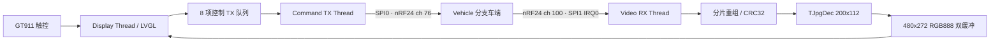

# RA8P1 触摸遥控与无线图传终端

本分支是巡检车现行遥控器固件，运行在 Renesas RA8P1 Cortex-M85 上。终端使用 1024x600 触摸屏向车辆发送控制命令，并接收车辆发回的 200x112 灰度 JPEG，解码后以 480x272 RGB888 显示在 LVGL 主页面。

> 当前有效产品代码只有 `Vehicle` 与 `RemoteCtrl` 两个分支。`legacy-single-core` 是早期单核版本；其中的摄像头、界面和图片可以作为历史参考，但不能用于描述当前系统架构或完成度。

## 当前状态

截至 2026-08-16，正式固件拓扑为“触控控制发送 + 车辆图像接收”，本地 OV5640 采集和同板双 nRF24 视频回环仅保留源码用于诊断，编译开关默认关闭。

| 状态 | 能力 | 说明 |
|---|---|---|
| 已验证 | 1024x600 LVGL/GLCDC 界面 | Display Thread 独占 LVGL，GT911 由 LVGL 输入端口轮询 |
| 已验证 | 触控控制发送 | 方向、启停、速度、模式、LED、风机、Wi-Fi 与页面事件编码为 8 字节控制包 |
| 已验证 | 双 nRF24 独立链路 | SPI0 发送控制，SPI1 接收视频，使用不同信道和地址 |
| 已验证 | JPEG 接收、校验与显示 | START/DATA/END 重组、CRC32、TJpgDec 解码、双缓冲和稳定展示缓冲链路完整 |
| 已验证 | 中断冲突规避 | Video RX 使用 P105/IRQ0；GT911 INT 使用 P111/IRQ19，RST 使用 P606 |
| 待量化 | 图传长期稳定性 | 当前缺少持续 FPS、连续帧号和丢帧率统计 |
| 待增强 | 控制安全策略 | 需要周期心跳、停车命令抢占和状态命令合并策略 |
| 已关闭 | 本地摄像头与视频回环 | 代码保留，但不属于正式运行路径 |

## 正式数据流



正式编译开关位于 `src/app_config.h`：

```c
#define APP_VIDEO_RX_ENABLE                  (1U)
#define APP_CAMERA_CAPTURE_ENABLE            (0U)
#define APP_LOCAL_VIDEO_LOOPBACK_ENABLE      (0U)
#define APP_VIDEO_RX_CONTROL_COMPAT_ENABLE   (0U)
```

因此当前遥控器：

- 只通过控制链路向小车发送命令；
- 只通过视频链路接收小车图像；
- 不启动本地 OV5640、MIPI-CSI 或 VIN；
- 不在视频信道解析历史控制包；
- 不执行同板发送/接收图像回环。

## FreeRTOS 任务

| 任务 | 优先级 | 栈 | 当前职责 |
|---|---:|---:|---|
| Display Thread | 4 | 16 KiB | `lv_timer_handler()`、GT911 轮询、安装最新稳定图像源 |
| Video RX Thread | 3 | 16 KiB | 系统初始化、视频收包、重组、CRC、JPEG 解码 |
| Command TX Thread | 2 | 16 KiB | 消费控制队列，通过 SPI0 nRF24 发送 8 字节控制包 |
| Touch Thread | 1 | 2 KiB | 预留，不访问 LVGL 或 I2C |

所有 LVGL API 都由 Display Thread 调用。GUI 事件回调只负责构造控制包并写入软件环形队列，真正的 SPI 发送由 Command TX Thread 完成。

Video RX Thread 先完成 IOPORT、SDRAM、LVGL Port、GT911、两颗 nRF24 和 GUI 初始化，再通过 `FreeRtosApp_NotifyInitialized()` 解除其他任务的启动等待。

## 无线链路

双方统一使用 5 字节地址、2 Mbps、2 字节硬件 CRC、Dynamic Payload 和小端多字节字段：

| 功能 | 遥控器角色 | 外设 | RF_CH | 地址 | 载荷 | ACK |
|---|---|---|---:|---|---:|---|
| 控制 | TX | SPI0 | 76 | `CMDRX` | 8 字节 | 开启 |
| 视频 | RX | SPI1 + P105/IRQ0 | 100 | `VIDEO` | 32 字节 | 发送端关闭，使用冗余发送 |

### 控制包

固定 8 字节：

```text
magic | version | control | action | value_le16 | sequence | xor
  A5  |    01   |  1..8   |  0..2  |   2 byte   | 1 byte   | 1 byte
```

方向按下时发送 `PRESSED`，释放或失去按压时发送 `RELEASED`；车端收到合法方向释放包后应立即停车。速度档位为 50%、62.5%、75%、87.5% 和 100%。

### 视频帧

```text
START -> DATA[0] -> DATA[1] -> ... -> DATA[N-1] -> END
```

车辆发送 200x112 基线灰度 JPEG。遥控器校验元数据、分片顺序、JPEG 长度和 CRC32，完整后使用 TJpgDec 解码并近邻放大到 480x272 RGB888。坏帧直接丢弃，活动帧 250 ms 没有新包时超时复位。

完整字段定义与联调检查表见 [doc/NRF24_VEHICLE_PROTOCOL.md](doc/NRF24_VEHICLE_PROTOCOL.md)。

## 硬件资源

| 模块 | 当前用途 |
|---|---|
| RA8P1 Cortex-M85 | 遥控器主控 |
| GLCDC + Dave2D | 1024x600 LCD 输出与图形加速 |
| GT911 + IIC1 | 触摸输入，INT=P111/IRQ19，RST=P606 |
| SPI0 nRF24L01+ | 控制发送，76 信道，不使用 IRQ |
| SPI1 nRF24L01+ | 视频接收，100 信道，IRQ=P105/IRQ0 |
| TJpgDec | 200x112 灰度 JPEG 解码 |
| SDRAM | JPEG、RGB888 解码缓冲和显示缓冲 |
| SEGGER RTT | 运行日志与故障诊断 |
| OV5640 / MIPI-CSI / VIN | FSP 配置和源码保留，正式固件不启动 |

`configuration.xml` 中的 SPI、I2C、GLCDC、IRQ、VIN 等 FSP Stack 位于全局 `_hal.0`。这表示生成全局外设实例，不表示所有任务都可并发访问；运行时所有权仍由任务入口和队列约束。

## 目录说明

```text
.
|- src/
|  |- hal_entry.c                 初始化、视频接收状态机、GUI/无线任务主体
|  |- app_config.h                正式拓扑编译开关
|  |- nrf24/                      nRF24 驱动、双链路与控制包队列
|  |- bsp/                        RA8P1 SPI/IRQ 传输适配层
|  |- GUI/                        GT911/GT1151 与 I2C 驱动
|  |- GLCDC/                      LCD 显示适配
|  |- port/                       LVGL 显示和输入端口
|  |- generated/                  GUI Guider 生成页面与事件
|  `- *_thread_entry.c            FSP 任务入口薄封装
|- gui/                           GUI Guider 工程与桌面模拟器资源
|- doc/
|  |- PROJECT_OVERVIEW.md         详细架构、任务所有权和优化建议
|  `- NRF24_VEHICLE_PROTOCOL.md   车端/遥控端统一协议
|- ra/                            FSP、中间件与 LVGL 代码
|- ra_gen/                        FSP 生成代码
|- ra_cfg/                        FSP 生成配置
`- configuration.xml              RA8P1 外设、引脚和线程配置
```

GUI Guider 重新生成页面时要特别检查 `src/generated/events_init.c`，避免覆盖控制事件逻辑。长期维护时应逐步把用户事件从生成目录迁移到稳定的自有模块。

## 开发环境与构建

- Renesas e2 studio，支持 RA8P1
- Flexible Software Package 6.5.0
- LLVM for Arm 21.1.1 (`clang_arm`)
- FreeRTOS
- LVGL 9.x / GUI Guider

建议构建流程：

1. 在 e2 studio 中导入根目录工程，工程名为 `RA8P1_Remote_RTOS`。
2. 确认器件为 `R7KA8P1KFLCAC`、核心为 Cortex-M85、FSP 为 6.5.0。
3. 如修改引脚、IRQ、SPI 或线程配置，通过 FSP Configurator 重新生成并审查 `ra_gen/` 差异。
4. 构建 Debug 配置并烧录目标板。
5. 通过 RTT 核对 `[LINK]`、`[COMMAND TX]`、`[VIDEO RX]`、`[IMG CHECK]`、`[JPEG DEC]` 和 `[FRAME]` 日志。

## 联调顺序

1. 先启动遥控器，确认 `[LINK] command_tx_ch=76 video_rx_ch=100`。
2. 确认 GT911 可操作方向、模式、速度、LED 和风机控件。
3. 再启动小车端 Video TX，遥控器应看到 `[IMG RX] START`。
4. 完整帧应依次出现 `[IMG CHECK] ... PASS`、`[JPEG DEC] ... PASS` 和 `[FRAME]`。
5. 控制链路分别验证按下、释放、RUN/STOP、速度与模式切换；方向释放必须立即停车。

地址、信道、数据率、CRC 或动态载荷任一不一致都会导致通信失败。近距离桌面联调时不要让两颗天线紧贴，并优先检查供电去耦、SPI 线序和 IRQ 引脚。

## 下一步

1. 增加视频 FPS、帧号连续性、坏帧和超时丢帧统计。
2. 增加周期控制心跳，并让方向释放和急停抢占普通状态命令。
3. 对速度、模式等状态类命令做“仅保留最新值”的队列合并。
4. 将双方图像协议常量提取为共享 C 头文件，减少字段漂移风险。
5. 拆分 `hal_entry.c` 中的初始化、视频服务和协议代码，并为控制包与图像分片增加主机端测试。
6. 测量三个 16 KiB 任务的 High Water Mark，按实测收敛栈配置。

## 配套分支

- `RemoteCtrl`：本 README 对应的现行遥控器固件。
- `Vehicle`：现行 RA8P1 双核巡检车固件。
- `gh-pages`：项目展示网页，只描述上述两个现行分支。
- `legacy-single-core`：历史单核版本，不用于当前构建、架构或进度判断。
